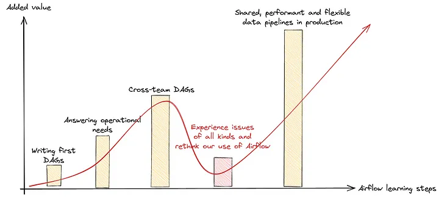
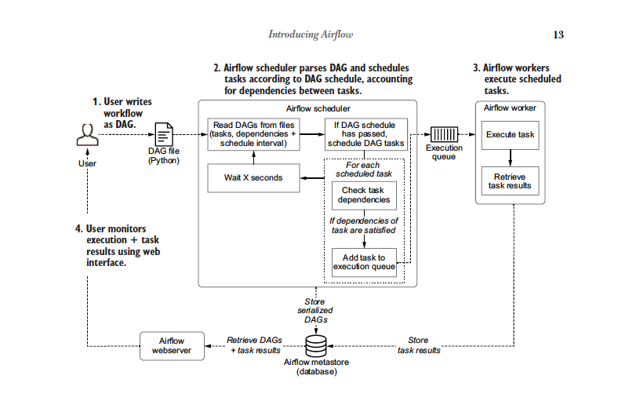
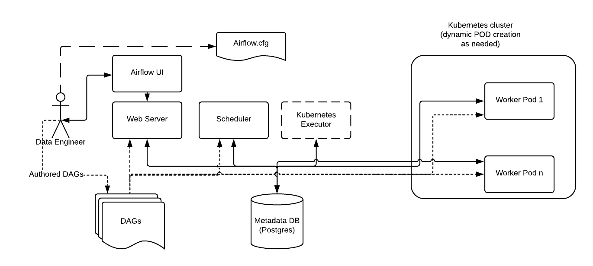
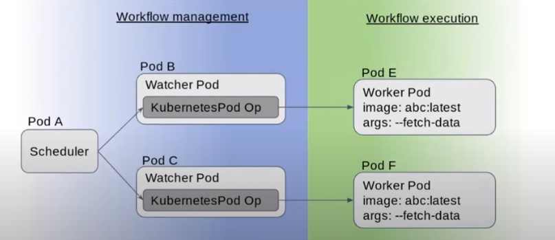

## Phases
### Phase 1
- Apache Airflow in DEV. 
- Use Postgres Database. Allow Airflow to apply its own schema in Postgres. Set up MIs. 
- Use SequentialExecutor. Very simple. 
- Create Git Repo for Airflow. Teams can make PRs to this repo, the files will be added to the DAG folder inside of the Dockerfile, and this will be built, pushed to ACR, and deployed in Helm Chart.

### Phase 2
- Custom RBAC. 
- KubernetesExecutor. Set up environment isolation measures. Set up pod templates, etc. Understand limitations of our clutser.
- Use Git submodules, more modularized CI/CD approach. If using Git-Sync, implement Git-Sync and PVC. 

    

## Pipelines, etc
### Overview
- Core assumption is that application teams will share a scheduler, web server, and metastore. 

### Architecture



### CI/CD Steps
- `airflow-main` will be initialized as a Git Repository with a Dockerfile that uses `airflow`'s image as its base.
- Application teams will create separate Git repositories containing their DAGs, and tagged with a version.
- `airflow-main` will add each application teams Git repository as a Git submodule. The DAGs from each Git submodule will be included in the Docker build for `airflow-main`, placing all app team DAGs in the Airflow DAG directory.
- `airflow-main` will go through the RTC build process, and be pushed to ACR with an image tag.
- The `airflow` Helm Chart will be updated with the image version of `airflow` that it is pulling from ACR (a modified image of `airflow`). The Helm Chart will be pushed and installed in its respective environment.
- The DAGBAG will consist of the Git submodules that were placed into the DAG_DIRECTORY. These will be used by executors and the scheduler, with the serialized DAGs placed into the Metadata store for usage by the web-server. 


### Isolation of Workloads



- Python environments remain consistent across workloads. For example, if using `SequentialExecutor`, and you initialize your `airflow` image with Pandas 1.3.5 for one DAG, you cannot use Pandas 2.2.2 for another DAG. The environment's are not isolated. And while you could create venvs corresponding to each DAG, this would become very complicated, very quickly. 
- The solution to this is to use `KubernetesExecutor`, and have workers configured to use `airflow` images that use the common `airflow` built off of originally in *only* their workloads. This would look like this:


#### Dockerfile for Custom `KubernetesExecutor`:
```
# Base Ariel-Airflow for Python 3-9
FROM python:3.9-slim

RUN pip install apache-airflow==2.1.0  # Install Airflow version compatible with your setup

# Set up the entrypoint for Airflow tasks
ENTRYPOINT ["airflow"]
```
```
# Base Ariel-Airflow for Python 3-9
FROM ariel-airflow-3-9:latest

# Install additional dependencies if needed
RUN pip install pandas==1.3.9 requests

```


#### DAG Utilizing Custom Python Image for its execution

```
from airflow import DAG
from airflow.operators.bash_operator import BashOperator
from airflow.operators.python_operator import PythonOperator
from datetime import datetime

default_args = {
    'owner': 'airflow',
    'start_date': datetime(2024, 1, 1),
}

with DAG('example_kubernetes_executor_custom_images',
         default_args=default_args,
         schedule_interval='@daily',
         catchup=False) as dag:

    # Task using Python 3.9 custom image
    task2 = PythonOperator(
        task_id='task2_python39',
        python_callable=lambda: print("Running task with Python 3.9"),
        executor_config={
            "KubernetesExecutor": {
                "image": "myrepo/recon-airflow:latest",
                "request_memory": "128Mi",
                "request_cpu": "500m",
                "limit_memory": "256Mi",
                "limit_cpu": "1000m",
            }
        }
    )

    task1 >> task2

```
- KubernetesExecutor requires a PodTemplateFile, which is the template for a Task that the KubernetesExecutor kicks off. You can use PodOverride to override the PodTemplateFiles, or just completely override the template file for a DAG. I imagine we will build a utility for each app team to write their own template file, etc. 
- An example of a more details override file can be found here. This override alters the default PodTemplateFile that is used to add a volume mount to both the Pod's main container and a sidecare container. This config is set in the Task's decorator (this example uses Airflows TaskFlow API). 
```
        executor_config_sidecar = {
            "pod_override": k8s.V1Pod(
                spec=k8s.V1PodSpec(
                    containers=[
                        k8s.V1Container(
                            name="base",
                            volume_mounts=[k8s.V1VolumeMount(mount_path="/shared/", name="shared-empty-dir")],
                        ),
                        k8s.V1Container(
                            name="sidecar",
                            image="ubuntu",
                            args=['echo "retrieved from mount" > /shared/test.txt'],
                            command=["bash", "-cx"],
                            volume_mounts=[k8s.V1VolumeMount(mount_path="/shared/", name="shared-empty-dir")],
                        ),
                    ],
                    volumes=[
                        k8s.V1Volume(name="shared-empty-dir", empty_dir=k8s.V1EmptyDirVolumeSource()),
                    ],
                )
            ),
        }

        @task(executor_config=executor_config_sidecar)
        def test_sharedvolume_mount():
            """
            Tests whether the volume has been mounted.
            """
            for i in range(5):
                try:
                    return_code = os.system("cat /shared/test.txt")
                    if return_code != 0:
                        raise ValueError(f"Error when checking volume mount. Return code {return_code}")
                except ValueError as e:
                    if i > 4:
                        raise e

        sidecar_task = test_sharedvolume_mount()
```
- Or - if you want to completely override the PodTemplateFile, you can do this, and even combine that with the pod_override:
```
import os

import pendulum

from airflow import DAG
from airflow.decorators import task
from airflow.example_dags.libs.helper import print_stuff
from airflow.settings import AIRFLOW_HOME

from kubernetes.client import models as k8s

with DAG(
    dag_id="example_pod_template_file",
    schedule=None,
    start_date=pendulum.datetime(2021, 1, 1, tz="UTC"),
    catchup=False,
    tags=["example3"],
) as dag:
    executor_config_template = {
        "pod_template_file": os.path.join(AIRFLOW_HOME, "pod_templates/basic_template.yaml"),
        "pod_override": k8s.V1Pod(metadata=k8s.V1ObjectMeta(labels={"release": "stable"})),
    }

    @task(executor_config=executor_config_template)
    def task_with_template():
        print_stuff()
```
- [**Example Kubernetes DAGs Provided by Apache Airflow**](https://github.com/apache/airflow/tree/providers-cncf-kubernetes/8.3.1/tests/system/providers/cncf/kubernetes)

### KubernetesPodOperator
- So - strange concept. When you execute a Task using KubernetesExecutor, a Pod is ran with apache-airflow installed, as well as the DAGs mounted. That Pod is repsonsible for reporting its status, completion, etc. The Task being executed is in the context of a Task in a DAG, and the KubernetesExecutor running on the Scheduler starts up a Pod to manage the completion of the Task.
- However, with the KubernetesPodOperator, the Task started up on the pod by the KubernetesExecutor will start up another pod when the KubernetesPodOperator is used, where the Pod pulls an image with arguments as runtime. 
- This Pod would be completely isolated from anything Airflow related - a completely independent workload. You can pass inputs to the Pod as args to the container, and pull any image, using any language (not just Python). 
- You can also use XCom here. XCom, in this scenario, would run a sidecar container on the Operator's Pod, and XComs written to a specific location can be read by the next task. 
- An example of how isolated this workload is: See `SparkKubernetesOperator`. 



<!-- ### Core Apache Airflow
- Helm Chart for Apache Airflow.
- Helm Chart Installation contains dependencies on postgres, airflow configs, etc. This will be installed via a pipeline. 
- Terraform would be used for provisioning Airflow DB, creating a Managed Identity to represent Airflow, etc. Some of these will be used in the Helm Chart
### App Teams
- App teams will create new Git Repository with all of the their DAGs, a YAML file, a Docker image.
- App teams will run a 

### Options
#### Git Sync
- Possible to have every team create different repository with all of their DAGs. A sidecar is ran alongside all Kubernetes pods that polls the Git repository. A PVC is mounted to the git-sync pod and all Airflow components. This approach ensures that any updates detected by GitSync are immediately avaliable to other  -->
- 


## Infrast

### Dependencies
#### Database
- Airflow requires a Database backend for its metadata store (information regarding Tasks, serialized DAGs, users, etc). While Airflow comes with a SQLite database, the backend can be configured to use PostgreSQL. 
- Both Airflow Executors, Airflow Scheduler, and Airflow Webserver access the metadata store. For example, the scheduler stores serialized DAGs in the metastore, the executors record the completion of task results (internal Kafka queue communicates from schedulers to executors when using KubernetesExecutor), and the web server retrieves task results for a DAG.
- Airflow configuration by default, uses a Connection String for connecting to Postgres.However, for our standard Postgres setup, we will be connecting to Azure PostgreSQL using Managed Identity. 
    - In contrast to the static Connection String expected by Postgres, we will need to dynamically generate and push updated Connection Strings containing an unexpired access token. Tokens expire roughly every six hours, if I'm not mistaken. 
    - A ConfigMap containing code for retrieving a refreshed access token will be created. This code should force generate, meaning that it would require new token generation, even if the previous token is not expired.
    - A Kubernetes CronJob will be scheduled to run at specified times, times with a higher frequency than access token expirary. The Cron Job would run the code in the ConfigMap for generating a new token, and dynamically alter the ConfigMap included in the Apache Airflow Helm templates containing Airflow's configuration (the `airflow.cfg`). The ConfigMap value for `sql_alchemy_conn` would be updated, and as this is mounted the web server, scheduler, and executor, the `airflow.cfg` would be updated in all components.
    - This would not catch database connection errors, such as when an access token is revoked, etc, and a new token is needed. This would need to be resolved. 
    - Both the pod running the CronJob, and each Airflow component would need to be assigned a Pod Identity for the Postgres Database. 
    - We could also avoid all of this completely by creating a static user in the database representing Airflow.
    - Wait - all of this is wrong. You can use a bash command for generating the SQLAlchemy Connection String. Here:
        ```
        sql_alchemy_conn_cmd = bash_command_to_run
        ```
    - I'm assuming this is dynamic? This will take more investigation to prevent unnecessary outbound requests which would burden the system. 
    
- A deep dive into all of the specific configs is necessary.
- Apache Airflow uses Alembic for managing schema changes, database object creation, version control tracking for migrations applied to schema, etc. It uses SQLAlchemy internally. 
- We can give Apache Airflow the necessary permissions, MI usage, and allow Airflow to run `airflow db init` and create the schemas in the DB. However, for other use cases, we use DML scripts to initialize schemas, etc. Installing applications to Kubernetes that require database is very common - there's gotta be articles, etc about the standard practices for platform engineers. I vote for now, in DEV, we let airflow manage its own schema, for a POC, etc, while we gain an understanding of best practices. 
- I bet managing the schema ourselves would become an absolute nightmare for upgrades. 

### RBAC / Auth
- For initial DEV release: *no RBAC. make a couple of accounts for logging into web server. Let's make the planning exhaustive, and the implentation come in phases.*
- Siteminder will sit in front of the Web Server. 
- Custom Flask AppBuilder Security Manager extended in Airflow. 
- Onboarding teams will create Sailpoint Groups for their apps.
- Sailpoint groups mapped to user groups in Azure AD. 
- Azure AD Groups mapped to roles, giving users ability to view, execute, etc, only their DAGs.   

**Initial Implementation**
- The first implementation will be simple. We can set:
    ```
    AIRFLOW__API__AUTH_BACKENDS: 'airflow.api.auth.backend.basic_auth,airflow.api.auth.backend.session'
    ```
- This will require creating an admin user. A login endpoint can be requested from the web server level, and a session cookie can be set on all further requests, or, Basic Authentication can be used. 
- To run 

### Azure Identities for Tasks
- Let's say an application team has constructed a Task to be executed using KubernetesExecutor, a Task that needs to access their created instance of Azure Blob Storage. In this situation, the team would, publish an AzureIdentity and AzureIdenityBinding to their namespace in the cluster, and assign the Managed Identity represented by the Azure Identity object a role assignment, of whatever scope is needed, to the Managed Identity targeted to their Azure Blob Storage account.
- Inside of the teams custom PodTemplateFile, or in a single PodTemplateOverride for a Task, if only one task is accessing Azure Blob Storage, the Pod can be assigned an `aadpodidentitybinding` label, allowing the `AzureIdentityBinding` to bind to the Pod based on its selector, and allowing for the Azure AD Pod Identity Kubernetes extension to handle all token management for the Pod running the Task.
- This approach would allow for an application team to have complete control over what resources in Azure they wish to access, what identities they would like to use, and how they would like to assign these identities to the workloads executing their Tasks within DAGs. 
- For on-prem and external sources with secrets, the same process can be followed to give Tasks the ability to retrieve secrets from an application team's **own** Azure Key Vault instance.  **Or**, better yet, the AKV extension can be use to mount secrets and CSI inline volumes to the Pod executing a workload. 
- Azure AD Pod Identity is depreciated - and has not received support by Azure since 2022 - but we continue to use this implementation on our platform. If have a reason you think we should migrate to Microsoft Entra Workload ID, let me know, and we can figure something out in the future. 

### Resource Management
- My proposal is that core Airflow Components, meaning webserver and scheduler, be on their own namespace, with the scheduler having the ability to preempt lower priority pods. Guaranteed QoS - these components should be better understood for the resources they use and require. 
- However, Tasks should be executed on Pods on an DAG author's individual namespace. For example, the ROW application would ensure that the Kubernetes Pod used to execute a Task is in the ROW namespace, and the resources requested by their Task are put towards the namespace ResourceQuota. If a Task surpasses what is allotted in the ResourceQuota, and cannot be scheduled, the Pod will continue waiting on a queue until it can be scheduled, unless that surpasses a timeout specified in the DAG. Or, if it is evicted during its process, the eviction will be communicated to the scheduler, and either retry logic or error handling logic will be executed.  

## Testing DAGs
- TBD. 

## Capabilities
### Event Driven DAGs
- TriggerDagRun - DAG gets triggered from another DAG. 
- Sensors - for when you want something to finish external to airflow, you need something to complete before your DAG runs. 
    - Another Operator in your DAG - essentially.
    - Highly use case specific - won't have to implement much logic. Otherwise, can implement your own sensor. 
    - Once it receives the event, it will mark the task is complete. It won't reset. 
    - You would have to maintain event based triggering with sensors and DAG schedule. 
    - You usually don't want to a sensor running for a ton of time, taking up compute.
- DeferrableOperators
    - Basically a sensor. Functions like normal operator/sensor, but frees up the compute while you are waiting for your incoming event. 
    - Will be a bit more complex in writing one. 
    - Also have to have trigger running - separately than airflow scheduler? 
- AirflowAPI
    - Best for when the event is TRULY random. You have no idea when you need to trigger. 
    - Best when DAG is outside of Airflow.  
    - Request only triggers DAG - doesn't wait for complete or receive a status. It is asynchronous.
- Triggers
    - Triggers are used for resuming deferred tasks. This happens on the first event fired


## Applications

### Recon Optimization Workflow

#### Steps - Retraining
- **Ingestion of Source of Data**
    - Option 1: External workload deployed that listens on Kafka queue for Source of Data, automatically storing the SOD records in Azure Blob Storage. The listener will then execute an API call to the Airflow web-server that triggers the SOW DAG. 
    - Option 2: External workload deploye dthat listens on Kafka queue for Source of Data, automatically storing the SOD records in Azure Blob Storage. The Airflow DAG is configured to run daily with a sensor dependent on Azure Blob Storage - waiting for the SOD to appear in Azure Blob Storage before executing.
    - Option 3: Airflow DAG created, and configured to run daily, with a sensor on the Kafka Topic, only running the DAG when it consumes a message on a Kafka topic matching a certain criteria. A dependent task will store the data contained in this message, or referenced in this message, to Azure Blob Storage.
- **Sample Generation Task**
    - Once the SOD is made avaliable, a Task will generate train / test samples from the Task and mount to DBFS. Retry logic, conditionality, etc can be applied here. This will conclude the DAG that is scheduled to run daily.
- # Other Things will Happen

#### Steps - Matching
- **Ingestion of Breaks Extract** - similar choice as Retraining with SOD.
    - *Example* - 1 DAG: 1 Task for ESP Breaks Retrieval, one for Breaks publishing to Azure Blob Storage, one for database.\.
- **Exception Coding** - DAG for categorizing / handling record discrepencies performed with a set of Tasks, all of which are able to be run in parellel, contain a complex set of dependencies, etc. End with Database update.
- **Matching Algorithm** - A DAG is ran that has a dependency on the Exception Coding DAG. Operators are used for database, databricks, etc etc, to handle all of this. Run a Spark Job as an Operator! Update database at the end. 
- **Man-In-the-Middle Matching** - DAGs for each user operation. Possible - determine best solution. 
- There are cases within Matching where, for example, after running the clutsering algorithm, you would have have differents for matched records and unmatched records. In this case, as the data processed by the clustering / scoring Task would be on a batch of records, you would *not* use conditional branching, you would use parallel processing like so: `clustering_task >> [matched_task, unmatched_task] >> join_task >> final_task`.


## Concepts
### Sensors
#### Use Cases
- A daily pipeline that processes financial data needs to wait for the presence of a new file in an S3 bucket, or data in a data lake. This ensures the daily ETL pipeline doesn't run until the data is present.
- Inside of a pipeline, an async job is executed. A sensor polls an API to determine if the job has completed its processing. 
- Event Based Triggers - an IoT data processing workflow that processes sensor data from various devices. 

## Tool Comparison
### Airflow vs Spark
- Spark focuses on high-performance, parallel data processing across nodes. Tasks are completed within Spark's own runtime environment. Airflow is distributed in its execution, however, it does not execute any tasks itself. Any Task executed in Airflow should use compute resources itself - it should Orchestrate the completion of tasks by external systems.
- Airflow manages the sequence, dependencies, scheduling of tasks within complex workflows with multiple interdependent steps. Spark manages tasks, but does not manage the orchestration involving different tools throughout different steps.
- Airflow is best for tasks invovling a series of tools and processes (due to its support for external connections) with multiple interdependent steps. Spark supports different system and tools as well, but mostly suited for large-scale data transformations, analytics, machine learning stuff, etc. 
- Airflow could define the overall workflow and scheduling of task execution, with the heavy data transformation performed within Spark Jobs, for example.  
### Airflow vs Logic Apps


### Examples of Apache Airflow Usage
#### ETL Pipelines - Made-Up
- A daily ETL job runs that extracts sales data from an e-commerce's Postgres DB, cleans and aggregates the data, and loads it to a data warehouse.
#### Data Science - Made-Up
- A workflow runs every week that extracts and cleans data prior to model training. It then orchestrates the execution of model training scripts, distributing the load. Airflow then handles tasks for model evaluation, packaging, and deployment. 
#### Reporting - Made-Up
- A workflow runs daily that aggregates financial data from several sources, generates a financial summary report in a variety of formats, and executes tasks to distribute the reports by sending over email, uploading to NAS drives, publishing to websites, etc. 
#### **Shopify Machine Learning Platform** - [*Source*](https://shopify.engineering/merlin-shopify-machine-learning-platform)
**Background** 
- Shopify has a machine learning platform team termed *Merlin* that build infrastructure and tools to assist data scientists in simplifying, streamlining their machine learning workflows.
- These use cases include fraud detection, revenue predictions, recommendation systems.
- In the Shopify ecosystem, data processing happens separately using Spark, with features and data saved to a data lake or feature store (Pano). Features and datasets are used as inputs to Merlin in its execution of machine learning tasks such as preprocessing, training, batch inference. Dedicated tasks are run as Ray clusters, Ray being a popular tool for scaling Python / AI workflows into parellel processes, orchestraing and scheduling Ray tasks across worker nodes deployed in, for example, Kubernetes. Typically taking the form of short lived batch jobs. Ray is used for its easy integration of its ecosystem of machine learning libraries, tools, etc to its distributed computing infrastructure. So like Databricks. Ray uses a "Ray Kubernetes Operator" in the same way that Airflow does, and Ray comes prepackaged in Merlin ML environments, allowing data scientists to deploy and run their machine learning workflows on remote Ray clusters, even in their development stages. A Merlin project being, a Docker container with a dedicated virtual envionrment, and allows for easy push and integration with the ecosystem, etc. They have a yaml file in their codespace that let's them connect to the Merlin API, send it there, and deploy on remote Ray clusters. 

**Airflow Usage**
- Data scientists push their code to Production. Users have the option of building orchestration workflows using YAML or configuring a DAG in the production Airflow environment. The jobs the data scientists build are scheduled to run periodically - for example, with a job running to create a Merlin workspace in PROD, train a model, and delete the workspace to return resources back to the Kubernetes cluster. 
- They use a tool called Datadog to monitor the Merlin job, sending logs to Splunk - not using Airflow's native tools. 
#### Shopify: Lessons Learned  - [*Source*](https://shopify.engineering/lessons-learned-apache-airflow-scale)
#### DBT Model Orchestration - [*Source*](https://medium.com/apache-airflow/how-we-orchestrate-2000-dbt-models-in-apache-airflow-90901504032d)
**Background**
- DBT (Data Build Tool) is an open-source tool for data transformation within a data warehouse, managing dependencies between steps, executing SQL queries, allowing lineage between execution of various SQL modules. DBT integrates with Git, manages dependencies between SQL models using DAGs.
**Airflow Usage**
- Workflow DAGs are scheduled to run at specified intervals to transform, process data within a production data warehouse.
- Each transformation is managed by DBT, which executes SQL scripts and manages dependencies between data models. 
- To solve some of their problems, they created a custom DBTOperator (as opposed to a PythonOperator or BashOperator). This allows them to specify additional logic, such as the operator parsing execution logs on DBT model failure and, if due to a schema change, refreshing the model. 
- **Dynamic DAG Generation** - These guys don't have developers creating their own DAGs. Instead, engineers put their sql files into files in their code workspace, and add a deployment.yml project specifying model groups (which are the dirs the DBT sql scripts that are placed in) with configuration specified for each, including the name, run schedule, tags, owners of the DAG.
- In the Dynamic Generation pipeline, it runs the models in a staging environment prior to pushing to production. 
- DAGs have dependencies on each other, because the DBT models have dependencies on each other. Apache Airflow Task Sensors are programatically generated from this. In the context of this project, DBTs run on different schedules. If DBT2 is dependent on DBT1, DBT2 confirms that DBT1 completed successfully before executing. 
    - They made their own DBTSensor, but Native Sensors include FileSensor, ExternalTaskSensor (airflow task), HTTPSensor (polls an endpoint), SQLSensor, S3KeySensor(waits for object to appear in S3 bucket). 
    - Would using this mechanism as a way to trigger jobs be anti-practice? 
- Ownership of DAGs determines 

Sources
- https://medium.com/apache-airflow/apache-airflow-bad-vs-best-practices-in-production-2023-78b95ce07158
- https://medium.com/apache-airflow/how-we-orchestrate-2000-dbt-models-in-apache-airflow-90901504032d
- https://medium.com/apache-airflow/what-we-learned-after-running-airflow-on-kubernetes-for-2-years-0537b157acfd
- [Dynamic Task Mapping Airflow](https://airflow.apache.org/docs/apache-airflow/stable/authoring-and-scheduling/dynamic-task-mapping.html)
- [Data-aware scheduling](https://airflow.apache.org/docs/apache-airflow/stable/authoring-and-scheduling/datasets.html) - Triggering Jobs
- https://www.astronomer.io/docs/learn/airflow-openai
- https://www.youtube.com/watch?v=QAfadJhP4UQ
- [#2 Airflow in Production: a CI/CD approach for DAG deployment and infrastructure management](https://medium.com/hipay-tech/using-airflow-in-production-a-ci-cd-approach-e0b23a9aefc3)
- https://towardsdev.com/a-simple-way-to-validate-and-test-your-dags-airflow-cicd-pipeline-cf7978dbbbd7
- Airflow Task groups https://www.astronomer.io/docs/learn/task-groups#:~:text=Unlike%20SubDAGs%2C%20Task%20Groups%20are,all%20while%20using%20less%20code!
- https://github.com/apache/airflow/discussions/30272
- [Manage Dags at scale: Dags versioning & package management](https://www.youtube.com/watch?v=uA-8Lj1RNgw)
- https://airflowsummit.org/sessions/2023/
- How to Deploy Airflow From Dev to Prod Like A BOSS
https://www.youtube.com/watch?v=kvsAwLLA9P4
- Docs: Set Up Database backend - https://airflow.apache.org/docs/apache-airflow/stable/howto/set-up-database.html
- Docs: Configuration Option Howto - https://airflow.apache.org/docs/apache-airflow/stable/howto/set-config.html#configuring-local-settings
- Docs: Export Dynamic Environment variables avalabile for Operators
https://airflow.apache.org/docs/apache-airflow/stable/howto/export-more-env-vars.html
- Docs: DAG File Processing - https://airflow.apache.org/docs/apache-airflow/stable/authoring-and-scheduling/dagfile-processing.html
    DAG File Processing refers to the process of turning Python files contained in the DAGs folder into DAG objects that contain tasks to be scheduled.
    Important
- Docs: Managing DAG files - https://airflow.apache.org/docs/helm-chart/stable/manage-dags-files.html ****